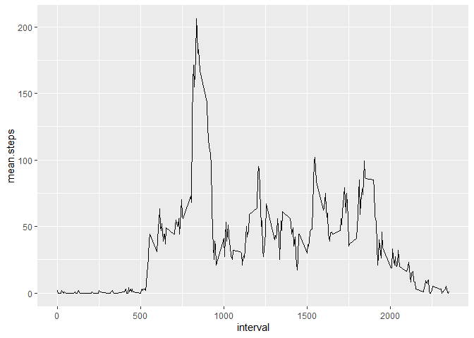
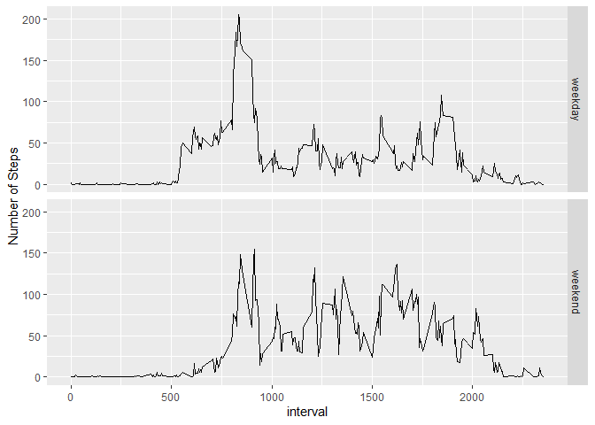

## Loading and preprocessing the data

```r
#Load required libraries
library(plyr)
```

```
## Warning: package 'plyr' was built under R version 3.6.2
```

```r
library(ggplot2)

#Load Data
activityData <- read.csv("activity.csv")
activityData$date <- as.POSIXct(activityData$date)
```

## What is mean total number of steps taken per day?

```r
#Get Daily Steps
dailySteps <- aggregate(activityData$steps, by = list(activityData$date), sum, na.rm=TRUE)
names(dailySteps) <- c("Date", "steps")

#Calculate Mean and Median
mean.steps <- mean(dailySteps$steps)
median.steps <- median(dailySteps$steps)
```

```
## Mean Daily Steps:  9354.23
```

```
## Median Daily Steps:  10395
```

```r
#Histogram
qplot(steps, data = dailySteps, geom="histogram", xlab = "Daily Number of Steps", binwidth = 300)
```

<!-- -->

## What is the average daily activity pattern?
#df of the mean and median number of steps taken, averaged across all days (y-axis)

```r
#Generate data frame for interval Steps
intervalStepsMean <- aggregate(activityData$steps, by = list(activityData$interval), mean, na.rm=TRUE)
intervalStepsMedium <- aggregate(activityData$steps, by = list(activityData$interval), median, na.rm=TRUE)
intervalSteps <- cbind(intervalStepsMean[], intervalStepsMedium$x)

#Tidy Data
names(intervalSteps) = c("interval","mean.steps", "median.steps")
intervalSteps$mean.steps <- round(intervalSteps$mean.steps)
intervalSteps$median.steps <- round(intervalSteps$median.steps)

#Find most steps
most.steps <- intervalSteps$interval[intervalSteps$mean.steps == max(intervalSteps$mean.steps)]
```

```
## Most average steps per day:  835
```

```r
#Plot
ggplot(intervalSteps, aes(x = interval, y = mean.steps)) + geom_line()
```

<!-- -->

## Imputing missing values

```r
# Find NAs
na.steps <- subset(activityData, is.na(steps))
num.NAs <-length(na.steps$steps)

# Replace NAs with median number
medianFilled <- data.frame(date=activityData$date[is.na(activityData$steps)], interval = activityData$interval[is.na(activityData$steps)], steps=intervalSteps[match(intervalSteps$interval, activityData$interval[is.na(activityData$steps)]),3])

#Remove NAs
activityData <- subset(activityData, !is.na(steps))

#Append median steps to activity data frame
activityData <- rbind(activityData, medianFilled)

#Sum steps for each day, calculate mean and median
dailySteps2 <- aggregate(activityData$steps, by = list(activityData$date), sum, na.rm=TRUE)
names(dailySteps2) <- c("Date", "steps")
mean.steps2 <- mean(dailySteps2$steps) 
median.steps2 <- median(dailySteps2$steps)
```

```
## Mean Daily Steps:  9503.869
```

```
## Median Daily Steps:  10395
```

```r
#Plot
qplot(steps, data = dailySteps2, geom="histogram", xlab = "Daily Number of Steps", binwidth = 300)
```

<!-- -->

## Are there differences in activity patterns between weekdays and weekends?

```r
#Seperate by Weekday and Weekend
activityData$week <- ifelse(weekdays(activityData$date) == "Saturday" | weekdays(activityData$date) == "Sunday" ,"weekend","weekday")

#Generate interval steps dataframe with mean and median
intervalSteps2Mean <- aggregate(activityData$steps, by = list(activityData$week, activityData$interval), mean, na.rm=TRUE)
intervalSteps2Median <- aggregate(activityData$steps, by = list(activityData$week, activityData$interval), median, na.rm=TRUE)
intervalSteps2 <- cbind(intervalSteps2Mean[], intervalSteps2Median$x)

#Tidy Data
names(intervalSteps2) = c("weekday", "interval","mean.steps", "median.steps")
intervalSteps2$mean.steps <- round(intervalSteps2$mean.steps)
intervalSteps2$median.steps <- round(intervalSteps2$median.steps)

#Plot
ggplot(intervalSteps2, aes(x = interval, y = mean.steps)) + ylab("Number of Steps") + geom_line() + facet_grid(weekday~.)
```

<!-- -->
